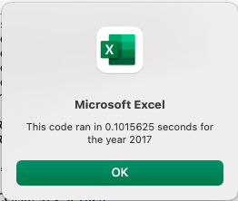
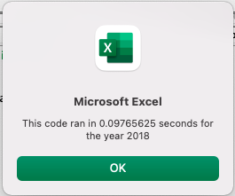

# Stock-Analysis Using VBA
VBA of Wall Street

# Overview
Assist Steve to help his parents analyze the performance of green every stocks in the years 2017 and 2018. 

## Purpose
Conduct an initial stock analysis for Steve and refractor the original VBA code to observe if the code will run more efficiently by measuring the time it takes to complete the code (original VBA script vs refractored script).

The VBA code uses a timer, arrays, if-then conditional statements, assigns long/string data types, and adds static/conditional formatting.

# Results
In order to make the code run more efficiently, I needed to switch the nesting order of the `for` loops. To achieve this, I first created a variable called the `tickerIndex` that accessed the correct index across the `tickers` array as well as the 3 new output arrays I created next: `tickerVolumes`, `tickerStartingPrices`, and `tickerEndingPrices`. Setting up the `tickerIndex` variable meant the code was able to assign the `tickerVolumes`, `tickerStartingPrices`, and `tickerEndingPrices` to each ticker symbol before looping through the entire dataset. Refactoring the code in this manner allowed it to run much faster than using the original script.
 
## Comparing the Original Run Times to the Refactored Run Times

Run times for the original code took around .71 seconds for 2017 and .64 seconds for 2018.

Run times for the refactored code took around .10 seconds for 2017 and 2018

 

 

Refactoring the code did make the run times decrease, which optimizes the code. 

# Summary
## 1. What are the advantages or disadvantages of refactoring code?
### Advantages
Refractoring can help with identifying unnecessary loops, duplicated subroutines, redundant statements and assist with debugging the original code. This can make code run more efficiently. Additionally, if code is refractored by another programmer, the programmer may be able to bring a fresh set of eyes and also perspective to executing the code. 

### Disadvantages

There can be different logic approaches to obtain the same result. This holds true in programming. Refractoring a code that is already stable and efficient can be costly to the desired outcome or introduce new errors into the code that prevent the code from successfully executing.

## 2. How do these pros and cons apply to refactoring the original VBA script?
Reducing the number of loops decreases the memory needed for processing the data, which reduces the run time and optimizes the performance of the script. To refactor the code, testing has to be done with each new addition to check for the efficiency of the new code.  
